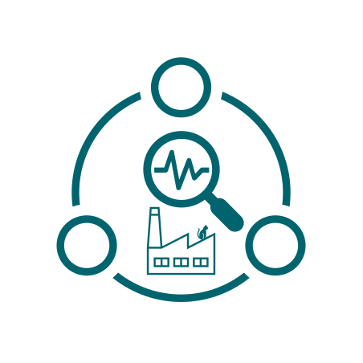

# MindSphere Analytics Examples

<!-- markdownlint-disable MD033 -->

<!-- markdownlint-enableMD033 -->

Examples how to use the mindSphere analytics APIs.

## Jupyter Notebooks demonstrating the use of the MindSphere Analytics APIs

### Trend Prediction API

The Trend Prediction API predicts future values for time series using linear and nonlinear regression models. It is a forecasting framework, that has many useful applications in the area of Process & Condition Monitoring.

Example: [Trend Prediction API](trend-prediction.ipynb)

### KPI Calculation API

The KPI Calculation API computes Key Performance Indicators (KPIs) for an asset. It uses data sources such as sensors, control units and calendars.

Example: [KPI Calculation API](kpi-calculation.ipynb)

### Spectrum Analysis API

Spectrum Analysis API allows users to perform time domain and frequency domain analysis. It provides functions to transform a time-domain signal into its frequency components (via Discrete Fourier Transform) and to detect threshold breaches of their amplitudes.

Example: [Spectrum Analysis API](spectrum-analysis.ipynb)

## Siemens API Notice

This project has been released under an [Open Source license](./LICENSE.md). The release may include and/or use APIs to Siemens’ or third parties’ products or services. In no event shall the project’s Open Source license grant any rights in or to these APIs, products or services that would alter, expand, be inconsistent with, or supersede any terms of separate license agreements applicable to those APIs. “API” means application programming interfaces and their specifications and implementing code that allows other software to communicate with or call on Siemens’ or third parties’ products or services and may be made available through Siemens’ or third parties’ products, documentations or otherwise.
